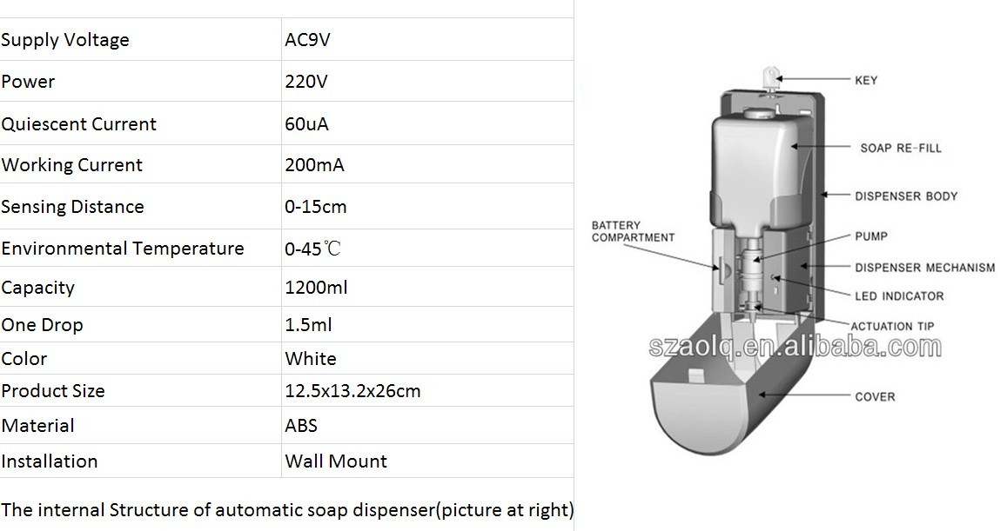

# Data

National standard for liquid soap density is 1.010 to 1.100 g/ml.

Ordinarily, the liquid soap of the present invention has a viscosity of 500 to 2500 cps at 15° C.

Flow-rate: 1.3ml -1.5ml /push

The main flow parameters do not change with distant along the flow Steady because the structure of the soap dispenser is more complex and cannot be directly determined Steady and Unsteady, uniform or non-uniform.

# Operating conditions

