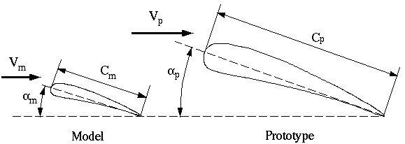

# The Purposes and Usefulness of Dimensional Analysis

- Dimensional analysis is a very powerful tool, not just in fluid mechanics, but in many disciplines. It provides a way to plan and carry out experiments, and enables one to scale up results from model to prototype. Consider, for example, the design of an airplane wing.

 

- The full-size wing, or prototype, has some chord length, cp, operates at speed Vp, and generates a lift force, Lp, which varies with angle of attack. In addition, the fluid properties of importance to this flow are the density and viscosity. After the preliminary design, it is usually necessary to perform experiments to verify and fine-tune the design. To save both time and money, these tests are usually conducted with a smaller scale model in a wind tunnel or water tunnel. In the sketch above, a geometrically similar model is constructed. In this case, the model is smaller than the prototype. In some cases the opposite is true; i.e. it may be prudent to build a large model of some small prototype in order to perform more accurate experimental analysis.

- The goal of the experimental tests is to find a relationship between the dependent variable (in this case the wing's lift) and the independent variables in the problem (in this case the velocity, the wing's angle of attack, chord length, and the density and viscosity of the fluid). Note that here we are neglecting the speed of sound, which is only important at very high speeds. The functional relationship can be stated as follows:

- There is a wrong way and a right way to conduct the experiments. The wrong way is to try to analyze the dependence of lift on each of the five independent variables separately. In other words, run the tests at many velocities (to see the effect of velocity on lift), and many angles of attack (to see the effect of angle of attack on lift), with many different model sizes (to see the effect of chord length on lift), and in many different fluids (to see the effect of viscosity and density on lift). This would take an enormous amount of time and resources, and it would be very difficult to summarize the results succinctly.

- The right way to do the experiments is to first perform a dimensional analysis of the above functional relationship, which leads to a revised form of the relationship in terms of nondimensional parameters or nondimensional groups. In this particular problem, dimensional analysis yields 

which is much simpler than the original functional relationship. In particular, instead of a dependent variable as a function of five independent variables, the problem has been reduced to one dependent parameter as a function of only two independent parameters. Furthermore, each of these three parameters is dimensionless, which makes them completely independent of the unit system used in the measurements.

- The parameter on the left is a kind of lift coefficient (the actual lift coefficient has a factor of 2 thrown in for convenience), while the first independent parameter on the right is called the Reynolds number. Angle of attack is already dimensionless, so it is a dimensionless group by itself.
 
- One plot is enough to completely describe the above functional relationship. In particular, lift coefficient is plotted versus angle of attack, and several curves are plotted at constant Reynolds number. This single plot is then valid for any size wing, in any Newtonian incompressible fluid, and at any speed. When experiments are conducted after performing the dimensional analysis, it is realized that only one wind tunnel model needs to be made, and only one fluid needs to be used (that fluid can be air or water or any other Newtonian incompressible fluid)! The wind tunnel or water tunnel test needs to consist of simply measuring lift as a function of velocity and angle of attack. Results of the experiment are plotted nondimensionally as indicated above.
