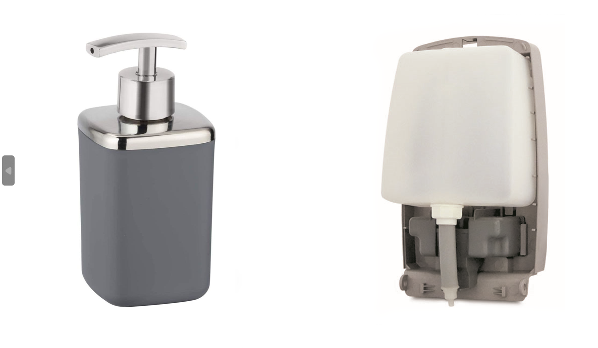

# Introduction

A soap dispenser (in Europe mostly known as a soap squirter) is a device that, when manipulated or triggered appropriately, dispenses soap (usually in small, single-use quantities). It can be manually operated using a handle or can be automatic. Soap dispensers are often found in public toilets. After the outbreak of the covid, it can be seen more often in public place.

The main application of the soap dispenser is used for cleaning and washing and if used on the skin to remove dirt, chemicals, bacteria etc. from the surface of the skin, to make sure we are clean and save.

